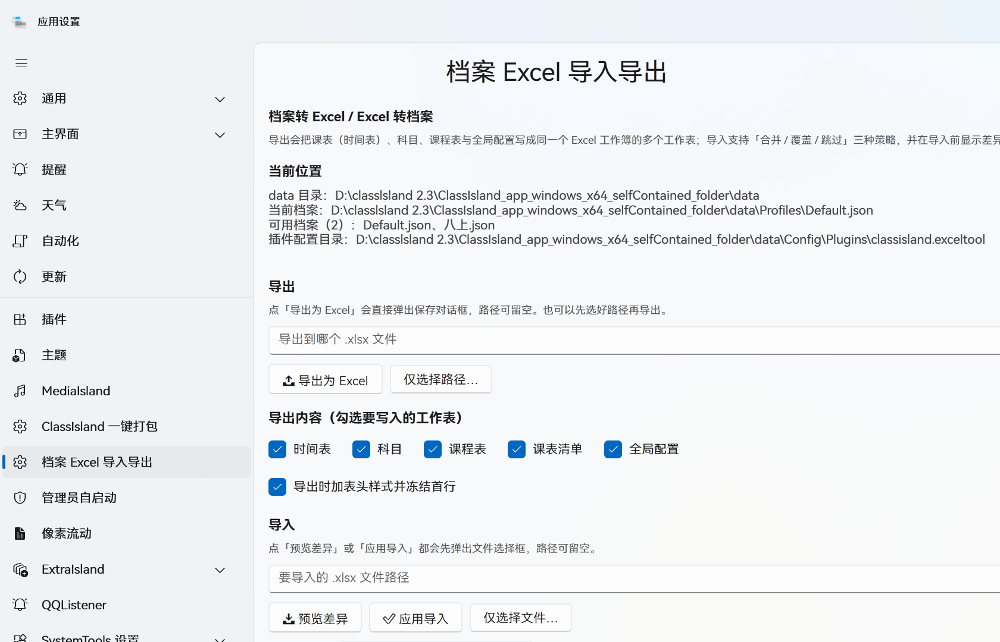

# ClassIsland.ExcelTool · 档案 Excel 导入导出

把 **ClassIsland** 的档案（时间表、科目、课程表、全局配置）导出成一份 Excel 工作簿，
改完之后再从 Excel 反向导入回 ClassIsland。

适用于批量排课的场合：在 Excel 里整列复制、公式计算、查找替换，比在设置窗口里一个个点快得多。



---

## 为什么需要这个插件

**ClassIsland 2.x 本身不提供 Excel 导入导出。**

1.x 时代（1.6.3.0 起，见 [Issue #410](https://github.com/ClassIsland/ClassIsland/issues/410)）
课表编辑器支持在 Excel 里来回倒腾，但 2.x 重构后这个能力没有保留下来。
目前 2.x 原生的「数据文件导入导出」走的是 `.json`——

```json
{"TimeLayouts":{"96fc89dc-739c-4321-a903-97947ad4760f":{"Name":"新时间表",
"Layouts":[{"StartTime":"23:40:00","EndTime":"23:41:00",...}]}}}
```

这种格式适合**整包备份 / 迁移到另一台机器**，但**不适合人编辑**：教师排课时想批量改某几节课、
或者直接拿年级主任发来的 `.xlsx` 课表，用 json 是没法办的。

社区里一直有人提这个需求：

- [Issue #1898 · 2.1重新支持Excel导入导出课程表](https://github.com/ClassIsland/ClassIsland/issues/1898)
  （2026-07 提出，至今仍为 open）

> 「有些学校课表变动频繁，而年级主任提供的电子课表是 xlsx 文件，每次换课表很不方便」

本插件就是把这块能力补回来：**在 Excel 里编辑，改完导回 ClassIsland**。

### 和原生导入导出的区别

| | 原生（`.json`） | 本插件（`.xlsx`） |
| --- | --- | --- |
| 用途 | 整包备份、迁移到别的 ClassIsland 实例 | 人工编辑课表内容 |
| 能否用 Excel 打开改 | ❌ | ✅ |
| 批量改、筛选、排序、公式 | ❌ | ✅ |
| 处理年级主任发来的 xlsx | ❌ | ✅（改好表头即可导入） |
| 含全局配置 | ✅ | ✅ |

两者不冲突，可以并存。

---

## 功能

### 导出

一次性把档案写成同一个 `.xlsx` 的多个工作表：

| 工作表 | 内容 |
| --- | --- |
| `时间表` | 时间表名称、是否叠放、是否启用，以及各时间点的起止时间 |
| `科目` | 科目名称、缩写、教师、是否室外 |
| `课程表` | 课表名称、科目名、行号、索引、是否启用、是否换课 |
| `课表清单` | 名称、时间表名称、是否启用、是否叠放、课时数 |
| `全局配置` | 主界面、提醒、天气等全局设置项 |

导出时可勾选要写入哪些工作表，也可以选择「加表头样式并冻结首行」，
方便在 Excel 里直接筛选和排序。

#### 关于那些「ID」列

ClassIsland 的档案内部是用 **GUID**（`96fc89dc-739c-4321-...` 这种 36 位乱码）做主键的。
直接照搬进 Excel 的话，每一行都要顶着一串乱码，根本没法看：

```
时间表ID                              时间表名称    叠放源ID
96fc89dc-739c-4321-a903-97947ad4760f  新时间表      ⊘null
96fc89dc-739c-4321-a903-97947ad4760f  新时间表      ⊘null
96fc89dc-739c-4321-a903-97947ad4760f  新时间表      ⊘null
```

所以本插件**默认不导出这些 ID 列**，表里只留人看得懂的内容：

```
时间表名称    是否叠放   是否启用
新时间表      FALSE     FALSE
新时间表      FALSE     FALSE
新时间表      FALSE     FALSE
```

导入时按**名称**匹配即可（`时间表ID` 之类的列留空也完全能正常工作）。
如果确实需要精确定位某个对象，可以勾上 **「导出隐藏的 ID 列」** ——
ID 会写在所有可见列的**右边**并自动隐藏，需要时展开看一眼，平时不碍事。

> 注：`课表清单` 的「关联分组」、`时间表` 的「默认课程ID」实际也是 GUID，
> 同样被归入隐藏 ID 列。

#### 关于「原始行(JSON)」

导出表里还有一列 `原始行(JSON)`，内容是一长串机械 JSON：

```
json:{"SubjectId":"9875b24c-470d-4195-8a6a-73925ea4808b","Index":null,"IsEnabled":true,...}
```

这列是**导入时的主路径** —— 靠它才能把每个对象原样重建、保证字段一个不丢。
所以它不能删，但人也确实不需要读它，于是**一律移到所有可见列的右边并隐藏**。

| 工作表 | 可见列 |
| --- | --- |
| `时间表` | 时间表名称、是否叠放、是否启用、行号、开始时间、结束时间、时长(秒)、类型、隐藏默认、课间名称、结束秒、附加对象(JSON)、行动集(JSON) |
| `科目` | 名称、简称、教师、是否室外 |
| `课程表` | 课表名称、科目名、索引、是否启用、是否换课、是否叠放、行号 |
| `课表清单` | 名称、时间表名称、是否启用、是否叠放、课时数 |
| `全局配置` | 配置项、值、类型、说明 |

> 想手动看一眼隐藏列：在 Excel 里**选中整行 → 右键 → 取消隐藏**。
> 隐藏不影响导入 —— 导入是按**表头名字**定位列的，读得到隐藏列的内容。

### 导入

导入前先用 **「预览差异」** 看清楚会发生什么改动，确认无误再点 **「应用导入」**。

三种导入策略：

| 策略 | 行为 |
| --- | --- |
| **合并**（推荐） | Excel 里有的就更新，本地多出来的条目保留 |
| **覆盖** | 以 Excel 为准，本地多出来的条目会被删除 |
| **跳过已存在** | 只新增，已存在的条目一律不动 |

导入按**表头名字**定位列：缺哪一列不影响其它列，表里出现了未识别的列会原样保留，
不会因为多加一列备注就把整份档案读坏。

---

## 安装

1. 下载 Release 里的压缩包（或自行编译）。
2. 解压到 `<ClassIsland 程序目录>\data\Plugins\classisland.exceltool\`。
   目录里应当能看到 `manifest.yml`、`ClassIsland.ExcelTool.dll`、`icon.png`。
3. 重启 ClassIsland。

## 使用

打开 **设置 → 外部 → 档案 Excel 导入导出**：

1. **导出**：点「📤 导出为 Excel」会直接弹出保存对话框，选个位置即可。
   也可以先点「仅选择路径…」定好路径再导出。
2. **导入**：点「📥 预览差异」选文件 → 看日志里的差异报告 → 点「✅ 应用导入」。
3. 建议保持 **「导入前自动备份档案」** 勾选。备份默认落在插件配置目录的 `Backups` 下，
   也可以在界面里指定别的目录。

> ⚠️ 导入会写回 ClassIsland 的档案文件。动手前请确认已勾选自动备份，
> 或者自己手动复制一份 `data\Profiles`。

---

## 从源码编译

```powershell
git clone https://github.com/pioneer66679/classisland.exceltool.git
cd ClassIsland.ExcelTool
dotnet build -c Release
```

产物在 `bin\Release\`，把 `manifest.yml`、`ClassIsland.ExcelTool.dll`、`icon.png`
以及依赖的 dll 一起丢进 `data\Plugins\classisland.exceltool\` 即可。

### 依赖

- .NET 8.0
- [`ClassIsland.PluginSdk`](https://www.nuget.org/packages/ClassIsland.PluginSdk) 2.0.1（`PrivateAssets=all`，不打进产物）
- [`ClosedXML`](https://www.nuget.org/packages/ClosedXML) 0.104.2 —— 纯托管 Excel 读写库，无本地依赖，可随插件分发

---

## 实现说明

导出和导入都没有手写 ClassIsland 的模型映射，而是以 `System.Text.Json` 的 `JsonNode`
作为中间表示直接读写档案 JSON。好处是 ClassIsland 升级增删字段时，插件不会被模型类绑死 ——
认得的字段照常读写，认不得的字段原样透传保留。

- 读档案时按**字段的序列化名**取值（例如时间表的激活字段是 `IsActive` 而不是 `IsActivated`）。
- 空时间表也会占一行写出，否则导入时无从得知它的存在。

---

## 许可

[MIT License](LICENSE) © 2026 aaa人機課長

可以自由使用、修改、再分发（包括商业用途），只需保留版权声明。

> 关于依赖：本插件引用 [ClassIsland.PluginSdk](https://www.nuget.org/packages/ClassIsland.PluginSdk)
> （`LGPL-3.0-only`）且设置 `ExcludeAssets="runtime"`，不随插件分发 SDK 程序集，
> 因此插件本身不受其传染性条款约束。
> Excel 读写使用 [ClosedXML](https://www.nuget.org/packages/ClosedXML)（MIT），可随插件分发。
